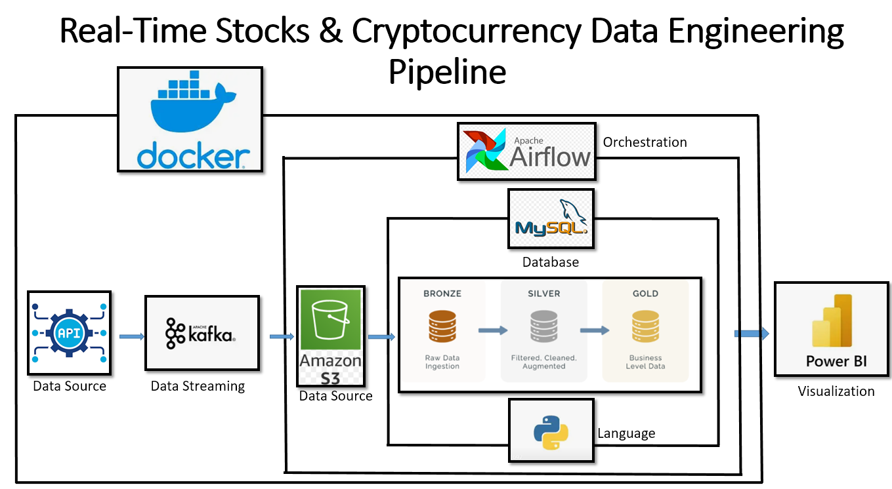

# 📈 Real-Time Stocks & Cryptocurrency Data Engineering Pipeline

<p align="center">
  
</p>

## 📖 Project Overview

This project is an end-to-end real-time data engineering pipeline that ingests live stock and cryptocurrency market data, processes it through a modern data pipeline, and visualizes key insights using Power BI.

The pipeline follows a layered data architecture (Bronze → Silver → Gold) and demonstrates real-world data engineering concepts including streaming, orchestration, data transformation, and business intelligence.

---

# 🚀 Technologies Used

| Category | Technology |
|----------|------------|
| Language | Python |
| Message Broker | Apache Kafka |
| Workflow Orchestration | Apache Airflow |
| Object Storage | MinIO |
| Database | MySQL |
| Containerization | Docker |
| Dashboard | Power BI |
| SQL | MySQL SQL |

---

# 🏗️ Architecture

<p align="center">
  
</p>

### Data Flow

```text
Finnhub API (Stocks)
          │
CoinGecko API (Crypto)
          │
          ▼
     Python Producer
          │
          ▼
     Apache Kafka
          │
          ▼
     Python Consumer
          │
          ▼
 MinIO (Bronze Layer)
          │
          ▼
 Apache Airflow ETL
          │
          ▼
 Silver Layer (MySQL)
          │
          ▼
 Gold Layer (MySQL)
          │
          ▼
   Power BI Dashboard
```

---

# 📂 Project Structure

```text
Data-Engineering-Stocks-and-Crypto-real-time-data
│
├── README.md
├── requirements.txt
├── .gitignore
│
├── images/
│   ├── architecture.png
│   ├── dashboard.png
│   └── airflow_dag.png
│
├── producer/
│   └── producer.py
│
├── consumer/
│   ├── stocks-consumer.py
│   └── crypto-consumer.py
│
└── infra/
    ├── dags/
    ├── sql/
    │   ├── silver/
    │   └── gold/
    ├── docker-compose.yml
    └── requirements.txt
```

---

# ⚙️ Data Pipeline

### Producer

- Retrieves live stock prices from Finnhub.
- Retrieves live cryptocurrency prices from CoinGecko.
- Publishes market data to Kafka topics.

### Consumer

- Reads messages from Kafka.
- Stores raw JSON data in MinIO (Bronze Layer).

### Apache Airflow

ETL pipeline:

- Extract raw JSON from MinIO
- Transform raw data
- Load into MySQL Silver tables

### SQL Transformations

Gold layer provides:

- Latest Stock KPIs
- Cryptocurrency KPIs
- Stock Treemap Dataset
- Candlestick Dataset

---

# 📊 Power BI Dashboard

<p align="center">
  
</p>

Dashboard includes:

- 📈 Live Stock Prices
- 💰 Cryptocurrency Prices
- 📊 Relative Volatility
- 📉 Candlestick Charts
- 🌳 Treemap Visualization
- 📌 KPI Cards

---

# 🔄 Apache Airflow DAG

<p align="center">
  
</p>

---

# 🚀 How to Run

## Clone Repository

```bash
git clone https://github.com/allenMP-DA/Data-Engineering-Stocks-and-Crypto-real-time-data.git
```

## Install Dependencies

```bash
pip install -r requirements.txt
```

## Start Docker

```bash
docker compose up -d
```

## Run Producer

```bash
python producer/producer.py
```

## Run Consumers

```bash
python consumer/stocks-consumer.py
python consumer/crypto-consumer.py
```

## Open Airflow

```
http://localhost:8080
```

---

# 📌 Future Improvements

- Real-time dashboard refresh
- DBT transformations
- CI/CD using GitHub Actions
- Cloud deployment (AWS/Azure)
- Data quality monitoring
- Apache Spark integration

---

# 👨‍💻 Author

**Allen Martinez Picazo**

Data Analyst | Data Engineer

GitHub:
https://github.com/allenMP-DA

